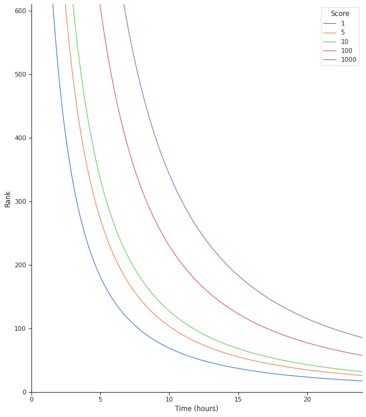

# Trending / Hot / Best Sorting algorithm

## Goals

- During the day, new posts and comments should be near the top, so they can be voted on.
- After a day or so, the time factor should go away.
- Use a log scale, since votes tend to snowball, and so the first 10 votes are just as important as the next hundred.

## Implementations

### Reddit

Does not take the lifetime of the thread into account, [giving early comments an overwhelming advantage over later ones,](https://minimaxir.com/2016/11/first-comment/) with the effect being even worse in small communities. New comments pool at the bottom of the thread, effectively killing off discussion and making each thread a race to comment early. This lowers the quality of conversation and rewards comments that are repetitive and spammy.

### Hacker News

While far superior to Reddit's implementation for its decay of scores over time, [Hacker News' ranking algorithm](https://medium.com/hacking-and-gonzo/how-hacker-news-ranking-algorithm-works-1d9b0cf2c08d) does not use a logarithmic scale for scores.

### Lemmy

Counterbalances the snowballing effect of votes over time with a logarithmic scale. Negates the inherent advantage of early comments while still ensuring that votes still matter in the long-term, not nuking older popular comments.

```
Rank = ScaleFactor * log(Max(1, 3 + Score)) / (Time + 2)^Gravity
Scaled_Rank = Rank / log(2 + Users_Active_Month)

Score = Upvotes - Downvotes
Time = time since submission (in hours)
Gravity = Decay gravity, 1.8 is default
Users_Active_Month = The number of users in a given community who have posted / commented in the last month.
```

- Lemmy uses the same `Rank` algorithm above, in three sorts: `Active`, `Hot`, and `Scaled`.
  - `Active` uses the post votes, and latest comment time (limited to two days).
  - `Hot` uses the post votes, and the post published time.
  - `Scaled` is similar to `Hot`, but gives a boost to smaller / less active communities.
- Use Max(1, score) to make sure all comments are affected by time decay.
- Add 3 to the score, so that everything that has less than 3 downvotes will seem new. Otherwise all new comments would stay at zero, near the bottom.
- The sign and abs of the score are necessary for dealing with the log of negative scores.
- A scale factor of 10k gets the rank in integer form.

A plot of rank over 24 hours, of scores of 1, 5, 10, 100, 1000, with a scale factor of 10k.



#### Active User counts

Lemmy also shows counts of _active users_ for your site, and its communities. These are counted within the last `day`, `week`, `month`, and `half year`, and are cached on starting up lemmy, and every hour.

An active user is someone who has posted or commented on our instance or community within the last given time frame. For site counts, only local users are counted. For community counts, federated users are included.
